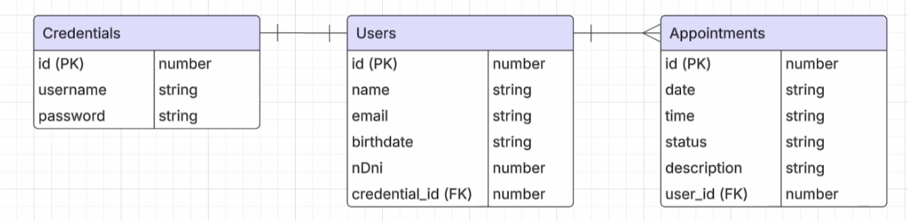

# User Stories 

- Como usuario invitado quiero ...
    1. Ingresar al Home para ver contenido y dinámica de la página
    2. Poder registrarme y crear una nueva cuenta 

- Como usuario registrado quiero ...
    1. Iniciar sesión con mis credenciales 
    2. Cerrar sesión 
    3. Reservar turnos 
        - Elegir fecha, hora y descripción
        - Recibir un email (extra credit)
    4. Cancelar un Turno 
        - Hasta un día antes del turno
        - Recibir un email (extra credit)

    5. Reagendar (extra credit)
    6. Visualizar listado de mis turnos reservados y cancelados 
    7. Poder modificar mi foto de perfil (extra credit)
        - Como admin. (extra credit)
        1. Banear usuarios 
        2. Cancelar turnos 
        3. Crear contenido 

# UX/UI

- Landing de Bienvenida 
- Home con información 
- Formulario de Registro, Login y Reserva de turnos
    - Intuitivo, con validaciones y que no se reinicie 
- Agradable a la vista 
- Que brinde respuestas 

# Diagrama E/R

